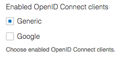
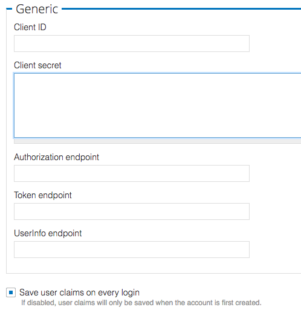

El _Inicio de sesión Mi Argentina_ está disponible para distintas plataformas:

1. [Aplicaciones web](#aplicaciones-web)
2. [Android](#android)
3. [iOS y macOS](#ios-y-macos)

---

## 1. Aplicaciones web

Existen muchas bibliotecas _Cliente OpendID Connect_ de distintas tecnologías:

- [Drupal](#drupal)
- [PHP](#php)
- [Otras bibliotecas](http://openid.net/developers/libraries/)

---

### Drupal

El módulo OpenID Connect proporciona una implementación cliente para el protocolo OpenID Connect.

La configuración del módulo es muy sencilla. Una vez instalado y habilitado el módulo OpenID Connect en Drupal, hay que configurarlo de la siguiente manera:

1. Habilitar la opción Generic:

	

2. Completar con las credenciales obtenidas del provider:

	

| Campo | Descripción |
| - | - |
| `Client ID` | Identificador de la aplicación. |
| `Secret ID` | Clave secreta de la aplicación. |
| `Authorization endpoint` | Endpoint de autorización. |
| `Token endpoint` | Endpoint para el intercambio de `code` por `access_token`. |
| `UserInfo endpoint` | Endpoint retorna los `Claims` del usuario final autenticado. |
{: class="table"}

El modulo OpenID Connect ofrecece la implementación de un cliente para el protocolo OIDC.

[Descargar cliente OpenID Connect SSO para Drupal](https://www.drupal.org/project/openid_connect_sso)

---

### PHP

Este módulo proporciona una implementación cliente para el protocolo OpenID Connect.

La configuración del módulo es muy sencilla:

#### Requsitos

1. PHP 5.2 o superior
2. CURL extension
3. JSON extension
4. [Composer](https://getcomposer.org/)

### Instalación

Ejecutar `php composer.phar install` para instalar las dependencias del archivo `composer.json`

```
$ php composer.phar install
```

#### Ejemplo: Cliente básico

```php
$oidc = new OpenIDConnectClient('https://id.argentina.gob.ar', 'ClientID', 'ClientSecret');
$oidc->addScope('openid profile optional');
$oidc->authenticate();
$name = $oidc->requestUserInfo('given_name');

echo $name;
```

[Descargar cliente OpenID Connect para PHP](https://github.com/jumbojett/OpenID-Connect-PHP)

---

## 2. Android

El SDK para Android permite a las personas iniciar sesión en tu aplicación mediante el _Inicio de sesión Mi Argentina_. Al hacerlo, las personas conceden a la aplicación permiso para obtener información o realizar acciones en Mi Argentina en su nombre.

Recomendamos 2 clientes SDK:

- [AppAuth para Android](#appauth-para-android)
- [AppAuth para Android (Google Codelab)](#appauth-para-android-google-codelab)

---

### AppAuth para Android

AppAuth para Android es un cliente SDK para comunicarse con proveedores OAuth 2.0 y OpenID Connect.

Soporta Android API 16 (Jellybean) en adelante.

[Descargar cliente SDK para Android](https://openid.github.io/AppAuth-Android/)

### AppAuth para Android (Google Codelab)

AppAuth Android Codelab es un cliente SDK provisto y mantenido por Google.

En este **[tutorial](https://codelabs.developers.google.com/codelabs/appauth-android-codelab/)** pueden instalar y configurar el cliente paso a paso.

---

## 3. iOS y macOS

AppAuth para iOS y macOS es un cliente SDK para comunicarse con proveedores OAuth 2.0 y OpenID Connect.

Soporta iOS 7 en adelante.

[Descargar cliente SDK para iOS y macOS](https://openid.github.io/AppAuth-iOS/)
